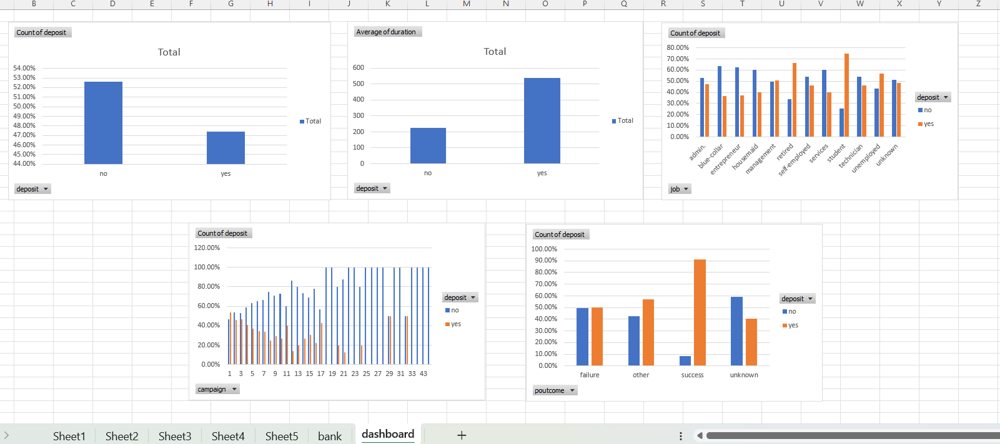
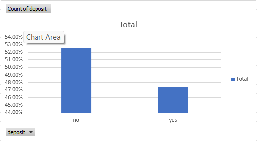
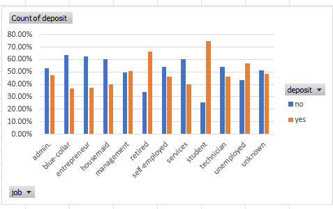
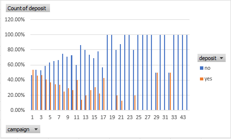
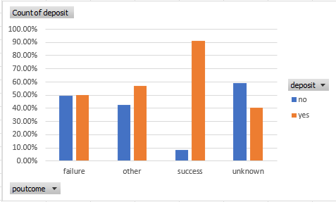
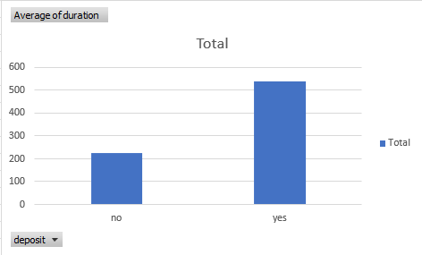

# FUTURE_DS_03
Marketing Funnel and Conversion Performance Analysis using Excel - Future Interns Data Science &amp; Analytics Task 3

## 🎯 Objective
Analyze marketing funnel performance to understand conversion rates and drop-off points.

---

## 🛠 Tools Used
- Microsoft Excel
- Pivot Tables
- Charts

---

## 📊 Key Analysis
- Conversion rate analysis
- Campaign performance
- Job-wise conversion
- Duration impact on conversions
- Previous campaign outcome analysis

---

## 🔍 Insights
- Longer engagement increases conversion
- Some jobs convert better than others
- Fewer contacts improve response rate
- Past success influences future conversion

---

## 💡 Conclusion
This analysis helps optimize marketing campaigns and improve conversion efficiency.

# 📊 Dashboard Preview

### Full Dashboard

---

### Conversion Analysis

---

### Job Analysis

---

### Campaign Performance

---

### Previous Outcome Analysis

---

### Average Behavior Analysis

